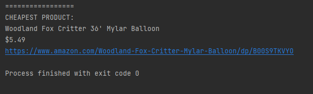
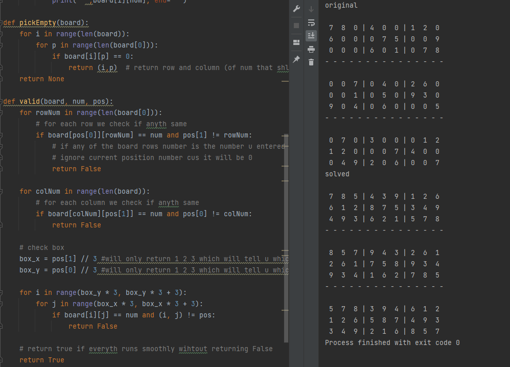

# Simple Python Projects
- prerequisites: have a basic understanding in python
- perfect starting point for intermediate python
- try doing the projects yourself with the description and example output below, then come back to the code if you need help :)
<br>
1. Encode and Decode Morse Code [2nd October]


- takes numbers and letters to encode into morse code (punctuations are ignored for now)
- each word separated with spaces worth 7 .
- each letter separated with spaces worth 3 .
- key concepts used: list(append), dictionary(.get), .join, .map, for loops, while loops, if elif else
<br>
2. Hangman [2nd October]


- takes input of a word from user
- another user to guess word, going letter by letter
- every wrong word adds one to the hangman drawing and also decreases the turns left
- program shows the current stage of guessed word
- key concepts: .lower(), list(append), while loops, for loops, if elif else,.join,.map
<br>

3. Price Comparison Tool [3rd October]


- track price of a product across different sources
- gets data from json file
- iterates from json data by storing in list of dictionaries using .load
- display only the cheapest product
<br>

3. Sudoku Solver [24th October]


- finds empty cells
- prints sudoku board
- valid function checks validity by row and column and then by box using for loops and if else statements
- final solve function to bring it all together
- run through all possible numbers (0-9) for each empty position, once valid would add to board and return True

<br>

## Usage
```
run python morsecode.py
run python hangman.py

OR you can just open .py files which will run automatically in command prompt
```

## Tech Stack
- Python

## Contact
Jolene - [jolenechong7@gmail.com](mailto:jolenechong7@gmail.com)
